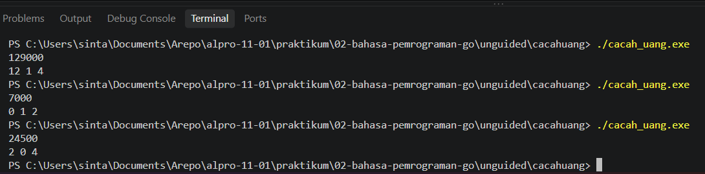
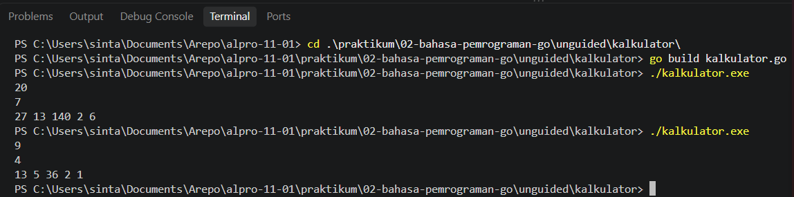

# <h1 align="center">Laporan Praktikum Modul 02 - BAHASA PEMROGRAMAN GO</h1>
<p align="center"> LINGGA ARKANANTA MAHARDIKA - 19092600012 </p>


## Dasar Teori

### A. Pengenalan Bahasa Pemrograman Go

Bahasa pemrograman Go (atau Golang) adalah bahasa pemrograman sumber terbuka yang dikembangkan oleh Google pada tahun 2007 oleh Robert Griesemer, Rob Pike, dan Ken Thompson. Go dirancang untuk membangun perangkat lunak yang sederhana, cepat, dan handal, serta memiliki dukungan bawaan yang sangat baik untuk konkurensi (Concurrency). Menurut Donovan dan Kernighan (2015), Go menggabungkan kemudahan penulisan bahasa tingkat tinggi dengan efisiensi eksekusi bahasa tingkat rendah.

### B. Struktur Program dan Tipe Data Dasar di Go

#### 1. Package dan Fungsi Utama (`main`)

Setiap program Go yang dapat dieksekusi harus berada dalam `package main`. Di dalam package ini, harus terdapat fungsi `func main()` yang bertindak sebagai titik awal (entry point) dari eksekusi program.

#### 2. Tipe Data, Variabel, dan Konstanta

Go adalah bahasa yang bersifat *statically typed*, yang berarti tipe data suatu variabel harus ditentukan secara eksplisit atau disimpulkan oleh kompiler saat kompilasi. Beberapa tipe data dasar meliputi `int`, `float64`, `bool`, dan `string`.

## Guided

### 1. `lingkaran.go`

```go
package main

import "fmt"

func main() {
	var r float64
	var luas float64
	pi := 3.14

	fmt.Scan(&r)
	luas = pi * r * r
	fmt.Println(luas)
}
```

#### Deskripsi lingkaran.go

Program ini adalah program untuk menghitung luas lingkaran. Di awal ada `package main` dan `import "fmt"` yang wajib ada biar program Go bisa di-build dan bisa pakai fungsi input output. Di dalam `func main()` dideklarasikan variabel `r` sebagai jari-jari dan `luas` untuk hasilnya, keduanya bertipe `float64` karena butuh bilangan desimal bukan `int` yang cuma buat bulat. Lalu ada `pi := 3.14` yang dideklarasikan pakai `:=` sebagai konstanta nilai pi. Program membaca input jari-jari pakai `fmt.Scan(&r)` jadi kalau lo input contoh `7` maka `r` akan berisi `7`. Perhitungan luasnya ada di baris `luas = pi _ r _ r` yang sesuai rumus `pi * r^2`. Terakhir hasilnya ditampilkan pakai `fmt.Println(luas)` jadi akan keluar luas lingkarannya.

### 2. `skor.go`

```go
package main

import "fmt"

func main() {
	var nama string
	var skorMatematika, skorBahasaInggris int

	//membaca input
	fmt.Scan(&nama)
	fmt.Scan(&skorMatematika)
	fmt.Scan(&skorBahasaInggris)
	
	//menenghitng total & rata-rata (pembagian bilangan bulat)
	total := skorMatematika + skorBahasaInggris
	rataRata := total / 2

	//menampilkan output
	fmt.Println(nama)
	fmt.Println(total)
	fmt.Println(rataRata)	

}

```

#### Deskripsi skor.go

Program ini adalah program untuk menghitung total dan rata-rata nilai siswa. Di atas ada `package main` dan `import "fmt"` sebagai header wajib Go biar bisa di-build dan pakai fungsi input output. Di dalam `func main()` dideklarasikan variabel `nama` dengan tipe `string` buat menyimpan teks, dan `skorMatematika` serta `skorBahasaInggris` dengan tipe `int` karena nilainya bilangan bulat bukan `float64`. Program membaca input pakai `fmt.Scan(&nama)` untuk nama lalu `fmt.Scan` untuk dua skornya, contoh kalau inputnya `Budi 80 90` maka `nama` jadi `Budi` dan dua skornya `80` dan `90`. Setelah itu ada perhitungan `total := skorMatematika + skorBahasaInggris` jadi `total` akan berisi penjumlahan keduanya, dan `rataRata := total / 2` yang pembagiannya masih bilangan bulat karena `total` tipenya `int` jadi kalau hasilnya desimal akan dibulatkan ke bawah. Terakhir semua hasilnya ditampilkan pakai `fmt.Println` baris per baris yaitu `nama`, lalu `total`, lalu `rataRata`.

### 3. `suhu.go`

```go
package main

import "fmt"

func main() {
	var celsius float64
	var reamur float64
	var fahrenheit float64
	var kelvin float64

	fmt.Scan(&celsius)

	reamur = celsius * 4.0 / 5.0
	fahrenheit = celsius * 9.0 / 5.0 + 32.0
	kelvin = celsius + 273.15

	fmt.Printf("%g %g %g", reamur, fahrenheit, kelvin)
}
```

#### Deskripsi suhu.go

Program ini adalah program konversi suhu dari `celsius` ke tiga satuan lain. Di awal ada `package main` dan `import "fmt"` sebagai header wajib Go untuk bisa di-build dan pakai fungsi input output. Di dalam `func main()` dideklarasikan empat variabel yaitu `celsius`, `reamur`, `fahrenheit`, dan `kelvin` semuanya bertipe `float64` karena menangani bilangan real atau desimal, bukan `int` yang cuma buat bilangan bulat. Program kemudian membaca input suhu dalam Celsius pakai `fmt.Scan(&celsius)`, contoh kalau lo input `100` maka variabel `celsius` akan berisi `100`. Setelah itu dilakukan perhitungan sesuai rumus, untuk `reamur` rumusnya `celsius _ 4.0 / 5.0` harus pakai `4.0` dan `5.0` biar hasilnya tetap `float64` karena kalau pakai `4 / 5` hasilnya jadi `0`, lalu `fahrenheit` pakai rumus `celsius _ 9.0 / 5.0 + 32.0` dan `kelvin` cukup `celsius + 273.15`. Terakhir semua hasil ditampilkan dalam satu baris pakai `fmt.Printf` dengan format `%g` supaya tampilannya bersih contoh outputnya jadi `80 212 373.15` untuk input `100`.

### 4. `tukar.go`

```go
package main

import "fmt"

func main() {
	var r float64
	var luas float64
	pi := 3.14

	fmt.Scan(&r)
	luas = pi * r * r
	fmt.Println(luas)
}
```

#### Deskripsi tukar.go

Program `tukar.go` ini adalah program untuk menukar nilai dari dua variabel. Di bagian atas ada `package main` dan `import "fmt"` yang wajib ada supaya program Go bisa di-build dan bisa pakai fungsi input output. Di dalam `func main()` dideklarasikan dua variabel `a` dan `b` dengan tipe `int` karena inputnya berupa bilangan bulat, kalau pakai desimal baru pakai `float64`. Kemudian program membaca input dari keyboard pakai `fmt.Scan(&a)` dan `fmt.Scan(&b)` jadi nilai yang lo ketik akan masuk ke masing-masing variabel, contoh kalau lo input `20` dan `7` maka `a` berisi `20` dan `b` berisi `7`. Inti dari program ini ada di baris `a, b = b, a` yaitu proses penukaran nilai secara langsung tanpa perlu variabel bantuan, ini fitur tuple di Go jadi setelah baris ini `a` jadi `7` dan `b` jadi `20`. Terakhir hasilnya ditampilkan pakai `fmt.Println(a)` dan `fmt.Println(b)` di baris yang terpisah.

## Unguided

### 1. `Cacahuang`

```go
package main
import "fmt"

func main() {
    var nominal int
    fmt.Scan(&nominal)

    lembar10ribu := nominal / 10000
    sisa := nominal % 10000

    lembar5ribu := sisa / 5000
    sisa = sisa % 5000

    lembar1ribu := sisa / 1000

    fmt.Printf("%d %d %d", lembar10ribu, lembar5ribu, lembar1ribu)
}
```

##### Output `Cacahuang`


#### Deskripsi

Program ini adalah program untuk memecah nominal uang menjadi lembaran `10000`, `5000`, dan `1000`. Di atas ada `package main` dan `import "fmt"` sebagai header wajib Go. Di dalam `func main()` dideklarasikan variabel `nominal` dengan tipe `int` karena inputnya bilangan bulat bukan `float64`. Program membaca input pakai `fmt.Scan(&nominal)` contoh kalau lo input `37000` maka `nominal` berisi `37000`. Perhitungan pertama `lembar10ribu := nominal / 10000` pakai pembagian bulat untuk dapat jumlah lembar sepuluh ribuan, dan `sisa := nominal % 10000` pakai operator `%` atau modulo untuk sisa setelah diambil sepuluh ribuan. Lanjut `lembar5ribu := sisa / 5000` dan `sisa = sisa % 5000` untuk hitung lembar lima ribuan dari sisanya, terakhir `lembar1ribu := sisa / 1000` untuk sisa yang jadi lembar seribuan. Semua hasil akhirnya ditampilkan sekaligus dalam satu baris pakai `fmt.Printf` dengan format `%d` untuk `int`, contoh output untuk `37000` jadi `3 1 2`.


### 1. `Kalkulator`

```go
package main

import "fmt"

func main() {
	var a, b int
	fmt.Scan(&a)
	fmt.Scan(&b)
	fmt.Printf("%d %d %d %d %d", a+b, a-b, a*b, a/b, a%b)
}
```

##### Output `Kalkulator`


#### Deskripsi

Program ini adalah program kalkulator operasi aritmatika dasar. Di atas ada `package main` dan `import "fmt"` sebagai header wajib Go. Di dalam `func main()` dideklarasikan dua variabel `a` dan `b` dengan tipe `int` karena operasinya bilangan bulat, kalau butuh desimal baru pakai `float64`. Program membaca dua input pakai `fmt.Scan(&a)` dan `fmt.Scan(&b)` contoh kalau lo input `10` dan `3` maka `a` jadi `10` dan `b` jadi `3`. Semua operasi langsung dihitung di dalam `fmt.Printf` dengan format `%d` untuk `int`, yaitu `a+b` untuk penjumlahan, `a-b` untuk pengurangan, `a*b` untuk perkalian, `a/b` untuk pembagian bulat jadi hasilnya tanpa koma, dan `a%b` pakai operator modulo untuk sisa bagi. Semua hasilnya ditampilkan dalam satu baris contoh untuk `10 3` outputnya jadi `13 7 30 3 1`.


## Kesimpulan

1. Bahasa pemrograman Go memiliki struktur yang bersih dan ketat, dimulai dari keharusan mendeklarasikan `package main` serta fungsi utama `func main()`.

2. Penggunaan struktur kontrol perulangan dan percabangan sangat membantu dalam menyelesaikan permasalahan logika berulang seperti pada studi kasus `cacahuang`.

## Referensi

1. JURNAL MODUL 02 - Golang

2. MODUL 2