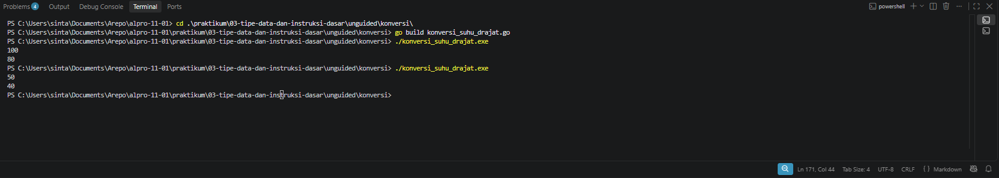
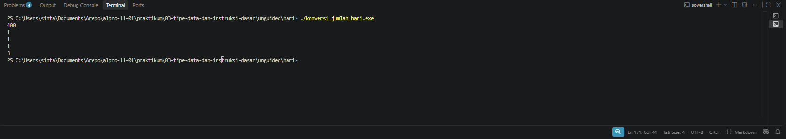

# <h1 align="center">Laporan Praktikum Modul 03 - VARIABLE DATA OPERATOR </h1>
<p align="center"> LINGGA ARKANANTA MAHARDIKA - 19092600012 </p>


## Guided

### 1. `kasir.go`

```go
package main

import "fmt"

func main() {
	var x int
	fmt.Scan(&x)


	var sepuluhRibu int = x / 10000
	var sisa int = x % 10000

	var limaRibu int = sisa / 5000
	sisa = sisa % 5000

	var seribu int = sisa / 1000

	fmt.Println(sepuluhRibu, limaRibu, seribu)

}
```

#### Deskripsi kasir.go

Program ini adalah program untuk menghitung jumlah lembaran uang kasir. Di atas ada package main dan import "fmt" sebagai header wajib Go biar bisa di-build dan pakai fungsi input output. Di dalam func main() dideklarasikan variabel x dengan tipe int buat menyimpan total uang input.Program membaca input pakai fmt.Scan(&x) untuk menyimpan nilai uang yang dimasukkan. Setelah itu ada perhitungan sepuluhRibu int = x / 10000 untuk menghitung berapa lembar 10 ribuan, lalu sisa int = x % 10000 untuk mengambil sisa uang setelah diambil 10 ribuan.Selanjutnya limaRibu int = sisa / 5000 untuk menghitung berapa lembar 5 ribuan dari sisa tersebut, lalu sisa = sisa % 5000 untuk update sisa lagi. Terakhir seribu int = sisa / 1000 untuk menghitung berapa lembar seribuan.Semua hasilnya ditampilkan pakai fmt.Println(sepuluhRibu, limaRibu, seribu) yaitu jumlah lembar 10 ribu, lalu 5 ribu, lalu 1 ribu.

### 2. `konversi.go`

```go
package main

import "fmt"

func main()	{
	var celcius float64;

	fmt.Println("Masukkan suhu dalam celcius: ")
	fmt.Scan(&celcius)
	
	fmt.Println(celcius + 273)
}
```

#### Deskripsi konversi.go
Program ini adalah program untuk mengkonversi suhu dari Celsius ke Kelvin. Di atas ada package main dan import "fmt" sebagai header wajib Go biar bisa di-build dan pakai fungsi input output. Di dalam func main() dideklarasikan variabel celcius dengan tipe float64 bukan string buat menyimpan teks, karena suhu bisa desimal.Program menampilkan tulisan dulu pakai fmt.Println("Masukkan suhu dalam celcius: ") biar user tau harus input apa, lalu membaca input pakai fmt.Scan(&celcius) untuk menyimpan nilai yang diketik user ke variabel celcius, contoh kalau inputnya 100 maka celcius jadi 100.Setelah itu ada perhitungan celcius + 273 yang merupakan rumus konversi ke Kelvin yaitu K = C + 273, jadi kalau celcius nya 0 hasilnya 273. Terakhir hasilnya ditampilkan pakai fmt.Println(celcius + 273).

### 3. `tukar.go`

```go
package main

import "fmt"

func main() {
	var x, y, z, temp int
	fmt.Scan(&x, &y, &z)

	temp = x
	x = y
	y = z
	z = temp

	fmt.Println(x, y, z)
}
```

#### Deskripsi tukar.go

Program ini adalah program untuk menukar nilai tiga variabel secara berputar. Di atas ada package main dan import "fmt" sebagai header wajib Go. Di dalam func main() dideklarasikan variabel x, y, z, temp dengan tipe int, dimana x, y, z buat input dan temp buat variabel bantu.Input dibaca pakai fmt.Scan(&x, &y, &z), jadi kalau inputnya 1 2 3 maka x=1, y=2, z=3. Proses tukarnya pakai temp = x buat simpan nilai awal x, lalu x = y dan y = z, terakhir z = temp buat balikin nilai awal x ke z.Hasil akhirnya ditampilkan pakai fmt.Println(x, y, z) yang akan jadi 2 3 1 kalau input awalnya 1 2 3.

## Unguided

### 1. `Konversi`

```go
package main

import (
	"fmt"
)

func main() {
	var celsius float64
	var reamur float64

	fmt.Scan(&celsius)

	reamur = (4.0 / 5.0) * celsius

	fmt.Println(reamur)
}
```

##### Output `konversi`


#### Deskripsi

Program ini dibuat untuk mengonversi suhu dari derajat Celsius ke derajat Reamur sesuai dengan rumus R sama dengan 4 per 5 dikali C. Pertama program mendeklarasikan variabel celsius dan reamur dengan tipe float64 karena masukan yang diminta berupa bilangan real. Kemudian program membaca nilai celsius dari input pengguna menggunakan fmt.Scan. Setelah nilai didapatkan, program melakukan proses perhitungan dengan mengalikan celsius dengan 4.0 dibagi 5.0, penggunaan 4.0 dan 5.0 bertujuan agar operasi pembagiannya menghasilkan bilangan real dan bukan pembagian integer yang akan menghasilkan nol. Hasil dari perhitungan tersebut disimpan ke dalam variabel reamur dan terakhir program menampilkan hasilnya ke layar menggunakan fmt.Println.


### 2. `Hari`

```go
package main

import "fmt"

func main() {
	var totalHari int

	fmt.Scan(&totalHari)

	tahun := totalHari / 360
	sisa := totalHari % 360

	bulan := sisa / 30
	sisa = sisa % 30

	minggu := sisa / 7
	sisaHari := sisa % 7

	fmt.Println(tahun)
	fmt.Println(bulan)
	fmt.Println(minggu)
	fmt.Println(sisaHari)
}
```

##### Output `Hari`


#### Deskripsi

Program ini untuk mengonversi hari ke tahun, bulan, minggu, dan sisa hari. Ada package main dan import "fmt" sebagai header wajib Go. Di dalam func main() ada variabel totalHari bertipe int buat input. Input dibaca pakai fmt.Scan(&totalHari).Lalu dihitung tahun := totalHari / 360 karena 1 tahun = 360 hari, sisanya totalHari % 360. Lalu bulan := sisa / 30 karena 1 bulan = 30 hari, lalu minggu := sisa / 7 karena 1 minggu = 7 hari, dan sisaHari := sisa % 7. Terakhir ditampilkan pakai fmt.Println untuk tahun, bulan, minggu, sisaHari.Kalau input 400 maka outputnya 1, 1, 1, 3.


## Kesimpulan

Dari semua program di praktikum ini yaitu konversi suhu, konversi jumlah hari, hitung lembaran kasir, dan tukar nilai, dapat disimpulkan bahwa konsep dasar pemrograman Go terletak pada penggunaan package main, import "fmt", dan func main() sebagai struktur wajib program. Untuk penyimpanan data digunakan variabel dengan tipe data yang sesuai, yaitu int untuk bilangan bulat seperti pada totalHari, x, y, z, temp, dan sepuluhRibu, serta float64 untuk bilangan desimal seperti pada celcius karena suhu bisa memiliki koma. Input dari user dibaca menggunakan fmt.Scan() dan output ditampilkan menggunakan fmt.Println() atau fmt.Printf().Logika utama dari semua tugas ini adalah penerapan operator aritmatika dasar. Operator pembagian / dan sisa bagi % digunakan untuk memecah nilai seperti pada konversi tahun = hari / 360, bulan = sisa / 30, minggu = sisa / 7 dan juga pada kasir sepuluhRibu = x / 10000. Sedangkan untuk penukaran nilai diperlukan variabel bantuan temp dengan teknik temp = x, x = y, y = z, z = temp agar nilai tidak hilang saat proses rotasi. Rumus konversi seperti kelvin = celcius + 273 juga menunjukkan penerapan instruksi dasar hitungan matematika.Jadi intinya, semua tugas ini melatih pemahaman tentang cara mendeklarasikan variabel, memilih tipe data yang tepat, membaca input, mengolahnya dengan rumus dan operator, lalu menampilkan hasilnya kembali.

## Referensi

1. -

2. -