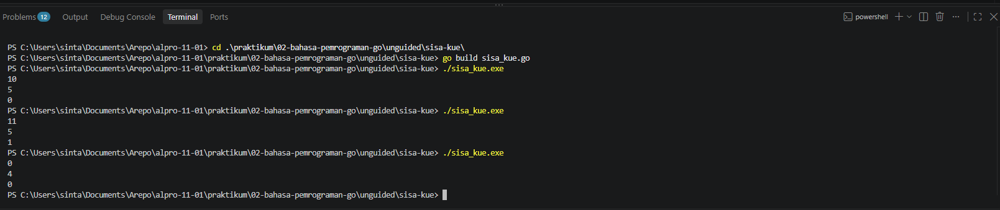
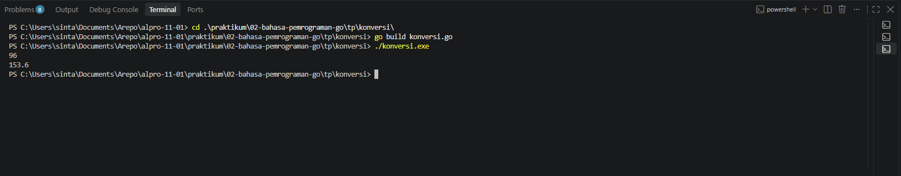

# <h1 align="center">Tugas Pendahuluan Modul 3 - VARIABLE DAN OPERATOR</h1>
<p align="center"> LINGGA ARKANANTA MAHARDIKA - 109092600012</p>

### 1. sisa_Kue.go

```go
package main

import "fmt"

func main() {
	var y, x int
	fmt.Scan(&y, &x)
	sisa := y % x
	fmt.Println(sisa)
}
```

##### Output
<!-- Path relatif dari readme.md ke folder unguided/[nama_soal]/output.png, contoh: -->


#### Deskripsi sisa_kue.go
Program ini untuk menghitung sisa kue setelah dibagi rata ke anggota keluarga. Ada `package main` dan `import "fmt"` sebagai header wajib Go. Di `func main()` ada variabel `y` dan `x` bertipe `int` untuk menampung jumlah kue dan jumlah anggota keluarga. Input dibaca pakai `fmt.Scan(&y, &x)` jadi kalau input `11 5` maka `y=11` dan `x=5`. Sisa kue dihitung dengan `sisa := y % x` pakai operator modulo `%` yang mengambil sisa pembagian, jadi `11 % 5` hasilnya `1`. Hasilnya lalu ditampilkan pakai `fmt.Println(sisa)`.


### 2. bool.go

```go
package main

import "fmt"

func main() {
	var b bool
	fmt.Scan(&b)
	fmt.Println(b)
}
```

##### Output bool.go
<!-- Path relatif dari readme.md ke folder unguided/[nama_soal]/output.png, contoh: -->



#### Deskripsi bool.go
Program ini adalah program untuk membaca dan mencetak nilai boolean. Ada `package main` dan `import "fmt"` sebagai header wajib Go biar bisa pakai `Scan` dan `Println`. Di dalam `func main()` dideklarasikan variabel `b` dengan tipe `bool` karena yang dibaca itu `true` atau `false`, bukan bilangan bulat jadi pakai `bool` bukan `int` atau `float64`. Input dibaca pakai `fmt.Scan(&b)` jadi kalau lo ketik `true` maka `b` akan berisi `true`. Terakhir program menampilkan kembali nilainya pakai `fmt.Println(b)` sesuai yang diminta di soal.


### 3. konversi.go

```go
package main

import "fmt"

func main() {
	var mil float64
	fmt.Scan(&mil)
	km := mil * 1.6
	fmt.Printf("%.1f", km)
}
```

##### Output konversi.go
<!-- Path relatif dari readme.md ke folder unguided/[nama_soal]/output.png, contoh: -->



#### Deskripsi konversi.go
Program ini untuk mengkonversi nilai mil ke kilometer. Di atas ada `package main` dan `import "fmt"` sebagai header wajib Go. Di `func main()` dideklarasikan variabel `mil` dengan tipe `float64` karena masukan berupa bilangan desimal, bukan `int`. Program membaca input pakai `fmt.Scan(&mil)` jadi kalau lo input `96` maka `mil` jadi `96`. Terus dihitung konversinya pakai `km := mil * 1.6` sesuai rumus `1 mil = 1.6 kilometer`. Hasilnya ditampilkan pakai `fmt.Printf` dengan format `%.1f` biar keluar 1 angka di belakang koma, contoh `153.6`.


## Kesimpulan
Berikut kesimpulan pembelajaran dari ketiga program tersebut yang ditinjau dari fundamental logika pemrograman:

Secara umum, ketiga program tersebut menerapkan alur logika dasar pemrograman yaitu Input - Proses - Output. Perbedaan hanya terletak pada tipe data dan jenis operasinya.

*1. Fundamental Tipe Data*
Pemilihan tipe data merupakan langkah awal yang krusial. Penggunaan `int` pada program sisa kue dan operasi aritmatika ditujukan untuk bilangan bulat, `bool` pada program kedua untuk merepresentasikan nilai logika `true` dan `false`, serta `float64` pada program konversi mil untuk menangani bilangan desimal. Ketepatan tipe data menentukan keakuratan proses selanjutnya.

*2. Fundamental Input*
Semua program menggunakan fungsi `fmt.Scan()` untuk menerima masukan dari pengguna. Penggunaan operator `&` berfungsi untuk menyimpan input ke dalam alamat memori variabel, sehingga nilai dapat diproses lebih lanjut.

*3. Fundamental Proses atau Logika*
Pada program pertama, diterapkan operator aritmatika `+`, `-`, `_`, `/`, dan `%`, di mana operator modulo `%` memiliki peran penting untuk menentukan sisa pembagian. Pada program kedua, tidak terdapat proses komputasi karena bersifat baca-tulis. Sedangkan pada program ketiga, diterapkan logika konversi matematis melalui operasi perkalian `mil _ 1.6` sesuai rumus yang diberikan.

*4. Fundamental Output*
Untuk menampilkan hasil, digunakan `fmt.Println()` untuk output standar dan `fmt.Printf()` untuk output terformat. Format specifier seperti `%d` untuk integer dan `%.1f` untuk pembatasan satu angka di belakang koma digunakan untuk menyesuaikan output dengan spesifikasi soal.

Kesimpulannya, ketiga program ini telah mencakup konsep dasar bahasa Go yang meliputi deklarasi variabel, mekanisme input, operasi logika dan aritmatika, serta pengaturan output. Penguasaan terhadap empat fundamental tersebut menjadi dasar untuk pengembangan program dengan tingkat kompleksitas yang lebih tinggi.