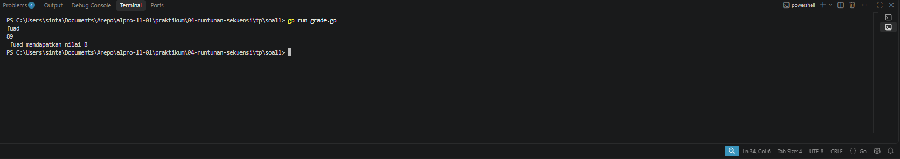
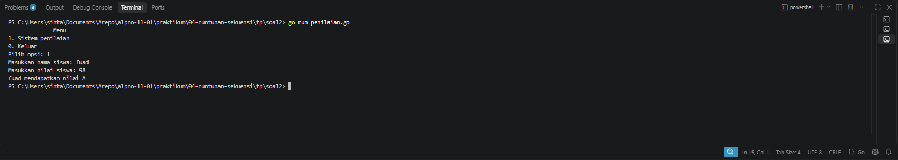
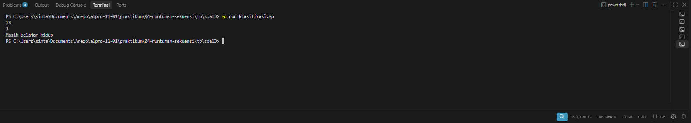

# <h1 align="center">Tugas Pendahuluan Modul 4 - RUNTUNAN SEKUENSI</h1>
<p align="center"> LINGGA ARKANANTA MAHARDIKA - 109092600012</p>

### 1. grade.go

```go
package main 

import (
	"bufio"
	"os"
	
	"fmt"
)

func main() {
	var nama string
	var nilai float64
	var grade string

	scanner := bufio.NewScanner(os.Stdin)
	scanner.Scan()

	nama = scanner.Text()


	fmt.Scan(&nilai)

	if nilai >= 90 && nilai <= 100 {
		grade = "A"
	} else if nilai >= 80 && nilai < 90 {
		grade = "B"
	} else if nilai >= 70 && nilai < 80 {
		grade = "C"
	} else if nilai >= 60 && nilai < 70 {
		grade = "D"
	} else {
		grade = "F"
	}

	fmt.Printf(" %s mendapatkan nilai %s\n", nama, grade)

}
```

##### Output penilaian.go
<!-- Path relatif dari readme.md ke folder unguided/[nama_soal]/output.png, contoh: -->



#### Deskripsi grade.go
Program ini berfungsi untuk menentukan grade mahasiswa berdasarkan nama dan nilai yang diinputkan. Input nama menggunakan bufio Scanner agar bisa membaca nama yang mengandung spasi, sedangkan input nilai menggunakan fmt.Scan. Setelah itu nilai akan dicek melalui kondisi if else untuk menentukan grade A sampai F, kemudian hasilnya akan ditampilkan dalam format nama mendapatkan nilai grade tersebut.


### 2. penilaian.go

```go
package main

import (
	"bufio" 
	"fmt"
	"os"
)

func main() {
	
	var pilihan int
	var nama string
	var nilai float64
	var grade string

	fmt.Println("============= Menu =============")
	fmt.Println("1. Sistem penilaian")
	fmt.Println("0. Keluar")
	fmt.Print("Pilih opsi: ")

	fmt.Scanln(&pilihan)

	if pilihan == 1 {
		fmt.Print("Masukkan nama siswa: ")

		scanner := bufio.NewScanner(os.Stdin)

		scanner.Scan()

		nama = scanner.Text()

		fmt.Print("Masukkan nilai siswa: ")
		fmt.Scanln(&nilai)

		// Menentukan grade nilai
		if nilai >= 90 && nilai <= 100 {
			grade = "A"
		} else if nilai >= 80 && nilai < 90 {
			grade = "B"
		} else if nilai >= 70 && nilai < 80 {
			grade = "C"
		} else if nilai >= 60 && nilai < 70 {
			grade = "D"
		} else {
			grade = "F"
		}

		fmt.Printf("%s mendapatkan nilai %s\n", nama, grade)

	} else if pilihan == 0 {
	
		fmt.Println("Keluar dari program.")

	} else {
		
		fmt.Println("Pilihan tidak valid.")
	}
}
```

##### Output penilaian.go
<!-- Path relatif dari readme.md ke folder unguided/[nama_soal]/output.png, contoh: -->



#### Deskripsi penilaian.go
Program ini adalah versi pengembangan dari program sebelumnya yang ditambahkan dengan sistem menu. Saat dijalankan program akan menampilkan menu pilihan 1 untuk sistem penilaian dan 0 untuk keluar. Jika pengguna memilih 1, program akan meminta input nama siswa menggunakan bufio scanner agar bisa membaca spasi dan input nilai, kemudian nilai tersebut akan diproses dengan percabangan if else untuk menentukan grade A sampai F dan hasilnya akan ditampilkan. Jika memilih 0 program akan keluar, dan jika memilih selain itu akan muncul pesan pilihan tidak valid.


### 3. klasifikasi.go

```go
package main

import ("fmt"

)

func main() {

	var usia int
	var gaji int
	var keterangan string

	fmt.Scan(&usia)
	fmt.Scan(&gaji)

	switch {
	case usia < 18:
		keterangan = "Masih sekolah"
	case usia >= 18 && usia <= 25 && gaji >= 50:
		keterangan = "Muda sukses"
	case usia >= 18 && usia <= 25 && gaji < 50:
		keterangan = "Masih belajar hidup"
	case usia >= 26 && usia <= 40 && gaji >= 100:
		keterangan = "Pekerja mapan"
	case usia >= 26 && usia <= 40 && gaji < 100:
		keterangan = "Perlu perbaikan karier"
	case usia > 40 && gaji >= 150:
		keterangan = "Profesional berpengalaman"
	case usia > 40 && gaji < 150:
		keterangan = "Perlu evaluasi finansial"
	}

	fmt.Println(keterangan)
}
```

##### Output klasifikasi.go
<!-- Path relatif dari readme.md ke folder unguided/[nama_soal]/output.png, contoh: -->



#### Deskripsi klasifikasi.go
Program ini berfungsi untuk menentukan keterangan status seseorang berdasarkan usia dan gaji yang diinputkan. Program akan membaca dua input angka yaitu usia dan gaji, kemudian melakukan pengecekan menggunakan switch case dengan beberapa kondisi usia dan nominal gaji untuk menentukan keterangannya seperti masih sekolah, muda sukses, pekerja mapan, dan seterusnya, lalu hasil keterangan tersebut akan ditampilkan sebagai output.


## Kesimpulan
Oke, ini kesimpulan pembelajaran dari 3 kode tadi:

*Kesimpulan Pembelajaran:*

*1. Konsep Input Output di Go*
- Belajar perbedaan `fmt.Scan` / `Scanln` untuk angka dan `bufio.Scanner` untuk string yang ada spasinya, biar nama kayak "Ahmad Yani" tidak kepotong.
- Belajar menampilkan output dengan format menggunakan `fmt.Printf` dan `fmt.Println`.

*2. Logika Percabangan (Branching)*
- *If Else (Kode 1 & 2):* Dipakai untuk klasifikasi bertingkat atau berurutan, contohnya penentuan grade A, B, C, D, F berdasarkan rentang nilai.
- *Switch Case (Kode 3):* Dipakai untuk klasifikasi yang lebih kompleks dengan banyak kondisi, contohnya menggabungkan 2 variabel sekaligus yaitu usia dan gaji untuk menentukan status seseorang.

*3. Pengembangan Logika Program*
- Dari kode 1 ke kode 2 terlihat perkembangan dari program sederhana menjadi program yang lebih interaktif dengan adanya sistem menu (pilihan masuk ke sistem penilaian, keluar, dan validasi input salah).
- Dari kode 1 & 2 ke kode 3 terlihat perkembangan dari 1 parameter penilaian (hanya nilai) menjadi 2 parameter penilaian (usia dan gaji).

Intinya ketiga kode ini melatih dasar paling penting dalam pemrograman yaitu bagaimana cara mengambil data dari user dan mengubahnya menjadi sebuah keputusan yang logis melalui percabangan.